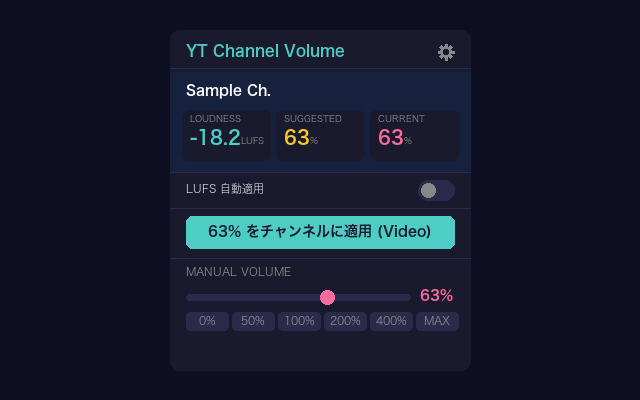
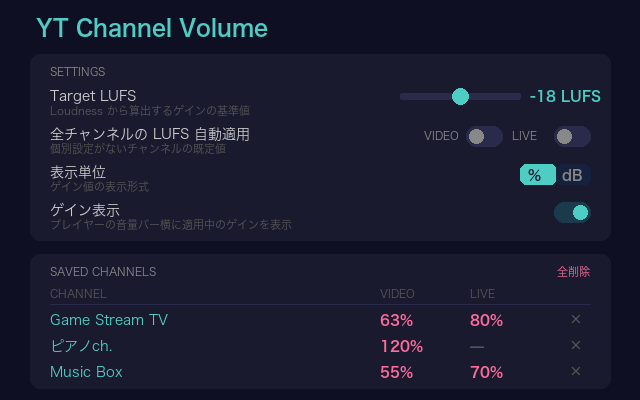
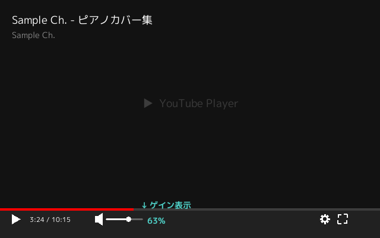

# YT Channel Volume

YouTube チャンネルごとに音量を記憶し、動画を開いた時に自動で適用する Chrome 拡張機能 (Manifest V3)。

> For the English version, see [README.md](README.md).

## 特徴

- **チャンネル単位の音量記憶**: 一度設定すれば、同じチャンネルの動画を開くたびに保存済みの音量が自動適用
- **Content Loudness からの最適音量算出**: YouTube が動画ごとに測定した Content Loudness を読み取り、ターゲット LUFS に基づいて最適なボリュームを算出。ワンクリックでチャンネルに保存
- **チャンネル別 LUFS 自動適用**: ポップアップには現在視聴中のVideo / Liveに対応するスイッチだけを表示し、チャンネル・種別別にON/OFF。ONの種別ではLUFSを検出できた動画をTarget LUFSに自動調整
- **全チャンネル既定値**: オプション画面でVideo / Live別にLUFS自動適用の既定値を設定可能。個別Auto設定のないチャンネル・種別が継承
- **ライブ / 動画で別音量**: 同じチャンネルでもライブ配信 (アーカイブ含む) と通常の動画で異なる音量を設定可能
- **手動ボリューム調整**: Autoが検出済みLUFSを適用している場合を除き、0〜600% の範囲でスライダーまたはプリセットボタンから設定
- **ゲイン表示**: プレイヤーの音量バーの横に現在のゲイン値を表示 (設定で ON/OFF)
- **単一のチャンネルゲイン**: AutoでもManualでもチャンネル・種別ごとに1つのゲインを更新するため、LUFS自動適用をON/OFFしても音量は変わらない。LUFS未検出時はポップアップのCurrentにFallbackを表示し、Saved Channelsでは`Auto (70%)`の形式で確認可能
- **日本語/英語**: ブラウザ言語設定で自動切替
- **外部依存ゼロ**: npm パッケージ・CDN なし。全コード自作

## スクリーンショット

**ポップアップ** — Loudness / Suggested / Current の表示、チャンネルへの適用、手動ボリューム



**設定画面** — Target LUFS、表示単位、保存済みチャンネルの一覧



**ゲイン表示** — プレイヤーの音量バー横に適用中のゲインを表示 (設定で ON)



英語 UI の画像は同じディレクトリの `*_en.png`。

## セットアップ

### 1. 拡張をインストール

[Chrome Web Store](https://chromewebstore.google.com/detail/yt-channel-volume/hoagpdjnapnpdbmnemhcdfpdehgokaab) からインストール

> **開発版を使う場合**: `chrome://extensions` → デベロッパーモード ON → 「パッケージ化されていない拡張機能を読み込む」でこのリポジトリのフォルダを指定

### 2. 使う

1. チャンネルの動画を開く
2. ポップアップに表示された現在のVideo / Live用「LUFS 自動適用」をONにする
3. LUFS を検出できる動画では Target LUFS に合わせたゲインが自動適用される
4. LUFS のないライブ配信などでは、保存済みのチャンネル音量が引き続き適用される

### 3. 設定

ポップアップの歯車アイコンから設定画面を開く:

- **Target LUFS**: Loudness から算出するゲインの基準値 (デフォルト: -18 LUFS)
- **全チャンネルのLUFS自動適用**: 個別設定がないチャンネルのVideo / Live別初期値 (デフォルト: OFF)
- **表示単位**: % または dB
- **ゲイン表示**: プレイヤー上にゲイン値をオーバーレイ表示 (デフォルト: OFF)
- **Saved Channels**: 保存済みチャンネルの一覧管理

## 仕組み

```
page-bridge.js (MAIN world, document_start)
  → ytInitialPlayerResponse / fetch hook / YouTube player DOM
  → loudnessDb + isLiveContent + channelId を取得
  → postMessage で content.js に中継

content.js (ISOLATED world, document_idle)
  → postMessage で loudnessDb を受信
  → チャンネルの LUFS 自動適用が ON なら動画ごとのゲインを算出・適用
  → OFF または LUFS 未検出なら保存済みチャンネルゲインを適用
  → Web Audio API GainNode で音量を制御
  → チャンネル設定の保存は service worker に依頼

background.js (service worker)
  → チャンネルごとの設定を書き込む唯一のコンテキスト
  → 複数タブが同じ保存領域を読んで書き戻す取りこぼしを防ぐ
```

- YouTube のボリュームスライダーには一切触れない
- ゲインが 1.0 (パススルー) の場合はオーディオチェーンを接続しない → Live Caption のちらつきを回避
- YouTube の CSP が inline script を禁止するため、loudnessDb 抽出は MAIN world の `page-bridge.js` で実行

## ビルド

```bash
# テスト実行
node test.js
node test-navigation.js
python3 test-screenshots.py

# アイコン再生成
python3 gen_icons.py

# スクリーンショット再生成 (docs/screenshots/)
python3 gen_screenshots.py

# コミット済みスクリーンショットが生成コードと一致するか確認 (書き込みなし)
python3 gen_screenshots.py --check

# Chrome Web Store 用 zip
python3 pack.py
# → yt-channel-volume-<version>.zip
```

## ファイル構成

```
yt-channel-volume/
├── manifest.json         # Manifest V3 設定
├── page-bridge.js        # MAIN world — loudnessDb 抽出
├── content.js            # ISOLATED world — ゲイン管理・チャンネル検出
├── background.js         # service worker — チャンネル設定の単一 writer
├── utils.js              # 共通定数・ユーティリティ (content/popup/options/service worker 共有)
├── popup.html/js         # ツールバーポップアップ
├── options.html/js       # 設定画面
├── _locales/             # i18n (ja, en)
├── icons/                # 拡張アイコン (16/48/128 px)
├── docs/screenshots/     # README・ストア掲載用スクリーンショット (ja, en)
├── tools/fonts/          # スクリーンショット描画用フォント M PLUS 1p (OFL)
├── test.js               # utils ユニットテスト
├── test-navigation.js    # ナビゲーション・データ整合性テスト
├── test-screenshots.py   # スクリーンショット出力先のパステスト
├── gen_icons.py          # アイコン生成 (Python pillow)
├── gen_screenshots.py    # スクリーンショット生成 (docs/screenshots/ へ出力)
├── pack.py               # zip パッケージング
├── PRIVACY_POLICY.md     # プライバシーポリシー (EN)
├── PRIVACY_POLICY_JA.md  # プライバシーポリシー (JA)
├── README.md             # README (EN)
└── README.ja.md          # README (JA)
```

## セキュリティ

- 外部へのネットワークリクエストは一切なし
- すべてのデータは `chrome.storage.local` にローカル保存
- 通信先は YouTube のみ (コンテンツスクリプトとして動作)
- ソースコードは全ファイル公開。第三者依存なし
- 詳細は [PRIVACY_POLICY.md](PRIVACY_POLICY.md) を参照

## 既知の制限

- **createMediaElementSource**: `<video>` 要素あたり 1 回のみ呼び出し可能。Volume Master 等の他の音量拡張と競合する場合がある
- **Shorts**: `/shorts/` パスの動画は対象外
- **ライブ配信の Content Loudness**: 配信中のライブには Content Loudness データがないため、「チャンネルに適用」は使用できない (アーカイブの Loudness から設定するか、手動ボリュームで設定)

## ライセンス

MIT
