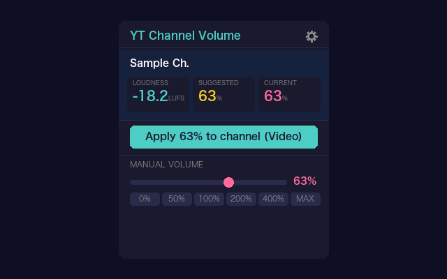
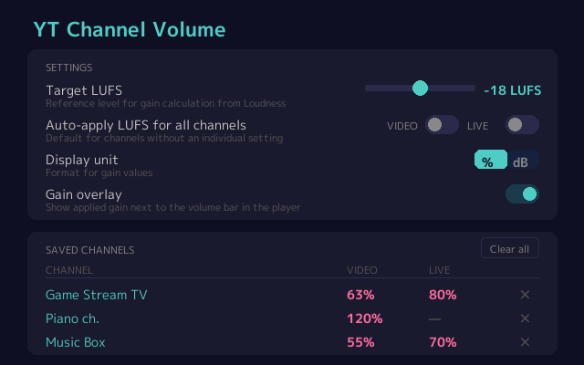
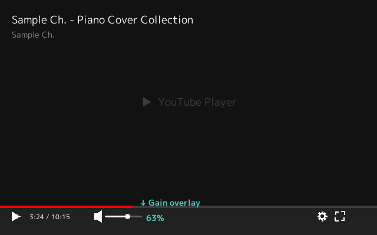

# YT Channel Volume

Chrome extension (Manifest V3) that remembers volume per YouTube channel and applies it automatically when you open a video.

> 日本語版は [README.ja.md](README.ja.md) を参照してください.

## Features

- **Per-channel volume memory**: Set it once, and the saved volume applies every time you open a video from that channel
- **Optimal volume from Content Loudness**: Reads the Content Loudness YouTube measures for each video and computes the optimal volume against the target LUFS. One click saves it to the channel
- **Per-channel LUFS auto-apply**: The popup shows only the switch for the kind you are watching, Video or Live, and it toggles per channel and kind. For a kind that is on, any video whose LUFS is detected is adjusted to Target LUFS
- **Global defaults**: The settings page sets the LUFS auto-apply default separately for Video and Live. A channel and kind with no individual Auto setting inherits it
- **Separate volume for Live and Video**: Within one channel, live streams (archives included) and ordinary videos can hold different volumes
- **Manual volume**: Set 0–600 % from the slider or the preset buttons, except while Auto is applying a detected LUFS
- **Gain overlay**: Shows the gain in force next to the player's volume bar (toggled in Settings)
- **One gain per channel and kind**: Auto and manual both update that single gain, so turning LUFS auto-apply on or off leaves the volume where it was. With no LUFS detected the popup marks Current as Fallback, and Saved Channels shows it in the form `Auto (70%)`
- **Japanese / English**: Follows the browser's language setting
- **No external dependencies**: No npm packages, no CDN. All code written from scratch

## Screenshots

**Popup** — the Loudness / Suggested / Current readout, applying to the channel, and manual volume



**Settings** — Target LUFS, the display unit, and the list of saved channels



**Gain overlay** — the gain in force, shown next to the player's volume bar (turned on in Settings)



The Japanese UI images are the `*_ja.png` files in the same directory.

## Setup

### 1. Install the extension

Install from the [Chrome Web Store](https://chromewebstore.google.com/detail/yt-channel-volume/hoagpdjnapnpdbmnemhcdfpdehgokaab)

> **To run the development build**: `chrome://extensions` → turn on Developer mode → **Load unpacked** and select this repository's folder

### 2. Use it

1. Open a video from the channel
2. Turn on **Auto-apply LUFS** in the popup for the kind you are watching, Video or Live
3. On a video whose LUFS can be detected, the gain that matches Target LUFS is applied automatically
4. Where there is no LUFS — a live stream, for instance — the saved channel volume keeps applying

### 3. Settings

Open the settings page from the gear icon in the popup:

- **Target LUFS**: Reference level for the gain computed from Loudness (default: -18 LUFS)
- **Auto-apply LUFS for all channels**: The Video / Live starting value for channels with no individual setting (default: off)
- **Display unit**: % or dB
- **Gain overlay**: Overlays the gain value on the player (default: off)
- **Saved Channels**: Manage the list of saved channels

## How it works

```
page-bridge.js (MAIN world, document_start)
  → ytInitialPlayerResponse / fetch hook / YouTube player DOM
  → reads loudnessDb + isLiveContent + channelId
  → relays them to content.js with postMessage

content.js (ISOLATED world, document_idle)
  → receives loudnessDb over postMessage
  → with the channel's LUFS auto-apply on, computes and applies a per-video gain
  → with it off, or with no LUFS detected, applies the saved channel gain
  → drives the volume through a Web Audio API GainNode
  → hands saving the channel settings to the service worker

background.js (service worker)
  → the one context that writes per-channel settings
  → prevents entries being dropped when several tabs read the same storage area and write it back
```

- YouTube's own volume slider is never touched
- At a gain of 1.0 (passthrough) the audio chain stays disconnected → avoids the Live Caption flicker
- YouTube's CSP forbids inline script, so loudnessDb extraction runs in the MAIN world from `page-bridge.js`

## Build

```bash
# Run tests
node test.js
node test-navigation.js
python3 test-screenshots.py

# Regenerate icons
python3 gen_icons.py

# Regenerate the screenshots (docs/screenshots/)
python3 gen_screenshots.py

# Compare the committed screenshots with what the code draws, without writing
python3 gen_screenshots.py --check

# Chrome Web Store zip
python3 pack.py
# → yt-channel-volume-<version>.zip
```

## File layout

```
yt-channel-volume/
├── manifest.json         # Manifest V3 settings
├── page-bridge.js        # MAIN world — loudnessDb extraction
├── content.js            # ISOLATED world — gain management, channel detection
├── background.js         # service worker — single writer for the channel settings
├── utils.js              # shared constants and utilities (content/popup/options/service worker)
├── popup.html/js         # toolbar popup
├── options.html/js       # settings page
├── _locales/             # i18n (ja, en)
├── icons/                # extension icons (16/48/128 px)
├── docs/screenshots/     # screenshots for the README and the store listing (ja, en)
├── tools/*.sh            # what the release workflow runs: the tag check and the version check
├── tools/fonts/          # M PLUS 1p (OFL), the face the screenshots are drawn in
├── test.js               # utils unit tests
├── test-navigation.js    # navigation and data integrity tests
├── test-screenshots.py   # path tests for the screenshot output directory
├── gen_icons.py          # icon generation (Python pillow)
├── gen_screenshots.py    # screenshot generation (writes into docs/screenshots/)
├── pack.py               # zip packaging
├── PRIVACY_POLICY.md     # privacy policy (EN)
├── PRIVACY_POLICY_JA.md  # privacy policy (JA)
├── README.md             # README (EN)
└── README.ja.md          # README (JA)
```

## Security

- No external network requests at all
- All data is stored locally in `chrome.storage.local`
- YouTube is the only origin it talks to (it runs as a content script)
- Every source file is published. No third-party dependencies
- See [PRIVACY_POLICY.md](PRIVACY_POLICY.md) for details

## Known limitations

- **createMediaElementSource**: Callable once per `<video>` element. It can conflict with other volume extensions such as Volume Master
- **Shorts**: Videos on the `/shorts/` path are not handled
- **Content Loudness on live streams**: A stream that is on air carries no Content Loudness data, so **Apply to channel** is unavailable there (set it from the archive's Loudness, or with the manual volume)

## License

MIT
